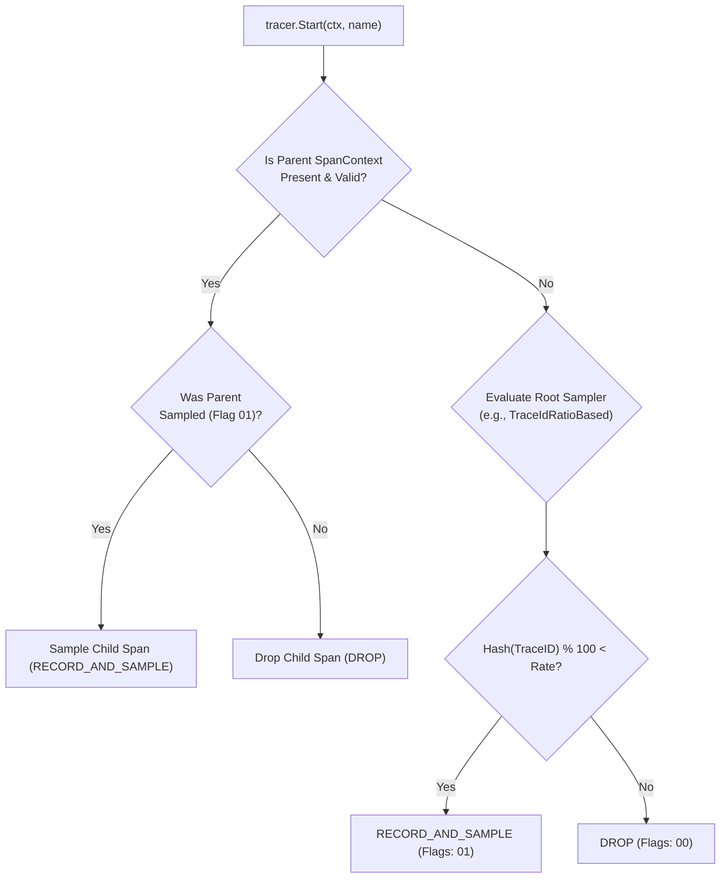

# OpenTelemetry Specification & Architecture

The OpenTelemetry project is formally partitioned into architectural specifications to ensure vendor neutrality, zero-overhead runtime safety, and clean separation of concerns.

---

## 1. Architectural Boundaries: API vs. SDK vs. Collector

```
+-------------------------------------------------------------------------+
| APPLICATION LAYER                                                       |
|                                                                         |
|  // Uses ONLY OpenTelemetry API (Zero dependencies on exporters/wire)   |
|  tracer := otel.GetTracerProvider().Tracer("payment-service")           |
|  ctx, span := tracer.Start(ctx, "charge_card")                          |
|  defer span.End()                                                       |
+-------------------------------------------------------------------------+
                                    |
                                    | Calls registered implementation
                                    v
+-------------------------------------------------------------------------+
| OPENTELEMETRY SDK (Registered at Application Initialization)            |
|                                                                         |
|  - TracerProvider / MeterProvider / LoggerProvider                      |
|  - Context Propagation (W3C TraceContext, W3C Baggage, B3)              |
|  - Head-Based Samplers (ParentBased, TraceIdRatioBased)                 |
|  - Resource Detection (K8s, Host, Cloud Provider Metadata)              |
|  - Span / Log Processors (BatchSpanProcessor, BatchLogRecordProcessor)  |
|  - OTLP Exporters (Protobuf over gRPC :4317 or HTTP :4318)              |
+-------------------------------------------------------------------------+
                                    |
                                    | OTLP Wire Protocol (gRPC/Protobuf)
                                    v
+-------------------------------------------------------------------------+
| OPENTELEMETRY COLLECTOR                                                 |
|                                                                         |
|  - Out-of-process high performance proxy                                |
|  - Receivers -> Processors -> Connectors -> Exporters                   |
|  - Tail-based sampling, OTTL transformations, persistent queues         |
+-------------------------------------------------------------------------+
```

### 1.1 The API Specification (No-Op Guarantees)
- **Zero Heavy Dependencies**: The API contains zero operational logic, zero network transport libraries, and zero disk I/O routines.
- **No-Op by Default**: If an application or third-party library imports the API and calls `tracer.Start()`, but no SDK is registered at runtime, the API executes a no-op implementation:
  - Spans return empty contexts.
  - Metrics drop recorded observations.
  - Zero memory buffers or network threads are allocated.
  - CPU overhead is bounded to simple pointer dereferencing (~2-5 nanoseconds).
- **Library Instrumentation Rule**: Shared open-source libraries (e.g., HTTP routers, ORMs, gRPC middlewares) **MUST ONLY** depend on the OpenTelemetry API. They must never register an SDK or configure exporters.

### 1.2 The SDK Specification (Runtime Engine)
The SDK implements the interfaces defined by the API. Applications register the SDK once at application startup (in `main()`).
- **Resource Attribution**: Populates static entity metadata (`service.name`, `service.version`, `k8s.pod.name`).
- **Thread Safety**: All API/SDK interfaces are strictly thread-safe. Spans and metrics can be invoked across hundreds of concurrent goroutines or threads without external synchronization.
- **In-Memory Buffering & Batching**: The `BatchSpanProcessor` and `BatchLogRecordProcessor` accept events synchronously from application threads, drop them onto a bounded ring-buffer queue, and flush in batches asynchronously via a background worker thread.
- **Graceful Shutdown**: Applications must call `TracerProvider.Shutdown(ctx)` during termination to flush pending telemetry buffers before the process exits.

---

## 2. In-Process Head-Based Samplers

Sampling reduces storage costs and network bandwidth by discarding unneeded traces. In the SDK, sampling decisions are made at the **head** (at root span inception) before child spans execute.



### Standard SDK Samplers
1. **`AlwaysOn` (`AlwaysSample`)**: Samples 100% of traces. Use for development, staging, or ultra-low-throughput systems.
2. **`AlwaysOff` (`NeverSample`)**: Drops 100% of traces (metrics and logs remain unaffected).
3. **`TraceIdRatioBased`**: Probabilistic sampler based on the least significant bits of the 128-bit `TraceID`. Guaranteed deterministic hashing across languages.
4. **`ParentBased` (Production Default)**:
   - Evaluates the incoming W3C `traceparent` flags:
     - If `parent.is_sampled == true`: downstream SDK samples the child span.
     - If `parent.is_sampled == false`: downstream SDK drops the child span.
   - If no parent exists (root span): delegates to a configured root sampler (typically `TraceIdRatioBased(0.10)` for 10% sampling).

---

## 3. Context Propagation & TextMapCarriers

Distributed tracing relies on propagating execution context across asynchronous thread pools, network RPCs, and message queues.

### 3.1 The Context Propagation Interface
Context propagation requires two primary methods:
- **`Inject(ctx context.Context, carrier TextMapCarrier)`**: Serializes active trace identifiers and baggage into wire headers.
- **`Extract(ctx context.Context, carrier TextMapCarrier) context.Context`**: Deserializes wire headers into a new child context.

### 3.2 Standard Propagators
1. **`tracecontext`**: W3C TraceContext (`traceparent`, `tracestate`).
2. **`baggage`**: W3C Baggage (`baggage: key=val,key2=val2`).
3. **`b3`**: Zipkin B3 Single (`b3: {TraceID}-{SpanID}-{Sampled}-{ParentSpanID}`) and Multi-header format (`X-B3-TraceId`, `X-B3-SpanId`).
4. **`jaeger`**: Legacy Uber Jaeger header (`uber-trace-id`).
5. **`composite`**: Chains multiple propagators together (e.g., W3C + Baggage + B3).

---

## 4. OpenTelemetry Protocol (OTLP) Specification

OTLP is the native wire protocol for OpenTelemetry, designed for high throughput, low CPU overhead, and minimal serialization footprints.

### 4.1 Transport Protocols & Default Ports
- **OTLP/gRPC**: Port **`4317`** (Protocol Buffers over HTTP/2 with binary framing and stream multiplexing).
- **OTLP/HTTP (Protobuf or JSON)**: Port **`4318`**
  - Traces: `/v1/traces`
  - Metrics: `/v1/metrics`
  - Logs: `/v1/logs`
  - Profiles: `/v1/profiles`

### 4.2 Encoding & Content Types
- `application/x-protobuf`: Standard production binary format (lowest CPU and wire size).
- `application/json`: Used for browser clients, webhooks, or legacy network gateways lacking protobuf support.
